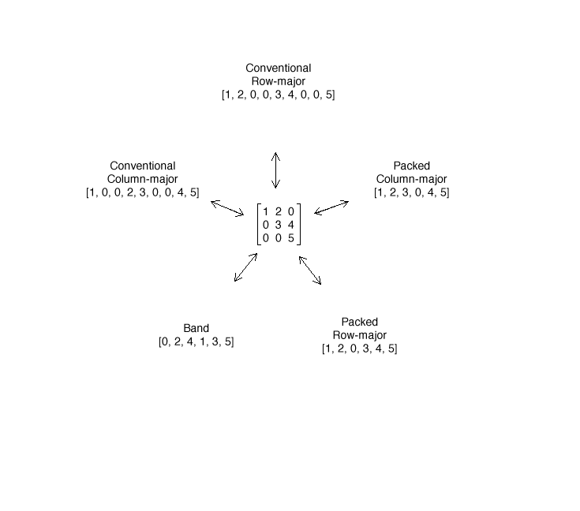

MaVec
===

A framework for performing matrix and vector math using first-class objects. Developed after trudging through the Accelerate framework's lack of quality documentation and cryptic function names, MaVec provides a more intuitive and Objective-C friendly interface (and documentation!). But don't worry--behind many of its methods are the same Accelerate functions you've grown to know and love. Or not. Which is why MaVec is here for you.

With MaVec you can create a matrix object from any of several array representations (conventional or packed row- or column- major, or band), with single- or double-precision floating point values, and then forget about the underlying details. It will choose the most efficient Accelerate function to perform a desired operation based on the matrix' characteristics (tridiagonal, symmetric, positive-definite, etc) and floating-point precision, while maintaining the most space-efficient backing store of values that you provide.



Supported Operations
===
**Vectors**
- Addition
- Subtraction
- Multiplication (vector/scalar)
- Division
- Powers
- Dot product
- Cross product
- Triple products (vector/scalar)
- Element sum/product
- L1/L2/L3/Inifity norm
- Maximum/minimum value
- Absolute value
- Random generation

**Matrices**
- Addition
- Subtraction
- Multiplication
- Division
- Transpose
- Inverse
- Minors
- Cofactors
- Adjugates
- Condition numbers
- QR factorization
- LU factorization
- Singular value decomposition
- Eigendecomposition
- Symmetry queries
- Definitenes queries (positive/positive semi/negative/negative semi/indefinite)
- Trace
- L1/infinity/max/froebenius(euclidean) norm
- Column/row swaps
- Column/row extraction
- Linear system solving
- Random generation (general/diagonal/triangular/symmetric/band)

Both MCMatrix and MCVector override NSObject's equality, description and hashing methods, implement the NSCopying protocol (so they can be inserted in Foundation collections!), and support object subscripting (`[matrix valueAtRow:3 column:3] == matrix[3][3]`) and [`debugQuickLookObject`](https://developer.apple.com/library/ios/documentation/ToolsLanguages/Conceptual/Xcode_Overview/DebugYourApp/DebugYourApp.html) for easier debugging.

See For Yourself
===

**MaVec QR factorization:**
```
//
// assume an array named "values" representing a 3x3 matrix 
// of either floats or doubles exists in column major format
//

MCMatrix *matrix = [MCMatrix matrixWithValues:[NSData dataWithBytes:values length:sizeof(values)]
                                         rows:3
                                      columns:3];
MCQRFactorization *qr = matrix.qrFactorization;
```

**Accelerate QR factorization:**
```
//
// assume an array named "values" representing a 3x3 matrix 
// of either floats or doubles exists in column major format
//

int m = 3;
int n = 3;
int lwork = -1;
int info;
  
if (sizeof(values) / sizeof(double) == 9) {
    double *a = malloc(9 * sizeof(double));
    for (int i = 0; i < 9; i++) {
          a[i] = values[i];
    }

    int lda = m;
    double *tau = malloc(MIN(m, n) * sizeof(double));
    double wkopt;
      
    dgeqrf_(&m, &n, a, &lda, tau, &wkopt, &lwork, &info);
      
    lwork = wkopt;
    double *work = malloc(lwork * sizeof(double));
      
    dgeqrf_(&m, &n, a, &lda, tau, work, &lwork, &info);
      
    lwork = -1;
    dorgqr_(&m, &m, &n, a, &lda, tau, &wkopt, &lwork, &info);
      
    lwork = wkopt;
    free(work);
    work = malloc(lwork * sizeof(double));
    dorgqr_(&m, &m, &n, a, &lda, tau, work, &lwork, &info);
      
    free(tau);
    free(work);

    double *q = a;

    double *r = malloc(m * n * sizeof(double));
    vDSP_mmulD(values, 1, a, 1, r, 1, m, n, m);
} else {
    float *a = malloc(9 * sizeof(float));
    for (int i = 0; i < 9; i++) {
          a[i] = values[i];
    }

    int lda = m;
    float *tau = malloc(MIN(m, n) * sizeof(float));
    float wkopt;
      
    sgeqrf_(&m, &n, a, &lda, tau, &wkopt, &lwork, &info);
      
    lwork = wkopt;
    float *work = malloc(lwork * sizeof(float));
      
    sgeqrf_(&m, &n, a, &lda, tau, work, &lwork, &info);
      
    lwork = -1;
    sorgqr_(&m, &m, &n, a, &lda, tau, &wkopt, &lwork, &info);
      
    lwork = wkopt;
    free(work);
    work = malloc(lwork * sizeof(float));
    sorgqr_(&m, &m, &n, a, &lda, tau, work, &lwork, &info);
      
    free(tau);
    free(work);

    float *q = a;

    float *r = malloc(m * n * sizeof(float));
    vDSP_mmul(values, 1, a, 1, r, 1, m, n, m);
}
```

Unit Tests
===
MaVec is a test-driven framework, where each method that is added comes with a unit test to ensure it doesn't break due to future changes. As of 4/19/2014 there are 223 tests.

Future Goals
===
- Efficient matrix chain multiplication
- Handle complex numbers
- Use entire catalog of specialized functions for a given operation based on matrix/vector characteristics (for instance, eigendecompositions of general, symmetric, triangular, tridiagonal, etc matrices all have different accelerate functions)
- Add more unit tests!
